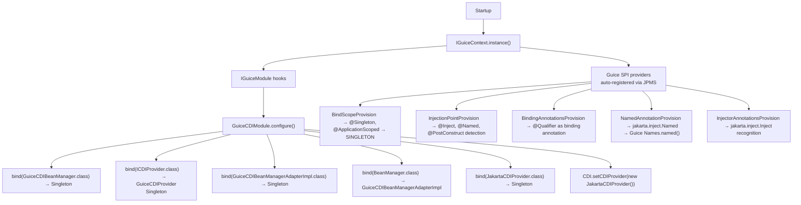
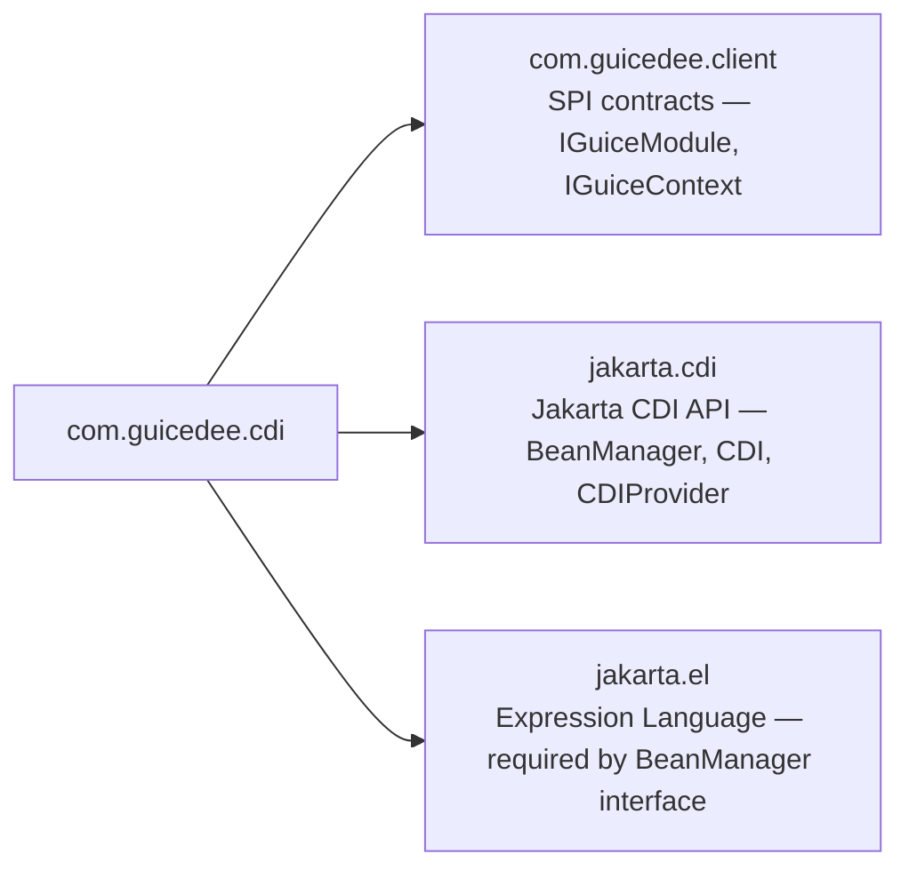

# GuicedEE CDI

> **⚠️ Migration & Compatibility Module** — This module is **not** part of the GuicedEE foundation. It exists solely to assist projects migrating from Jakarta CDI-based frameworks to the native Guice-first model. New projects should use Google Guice annotations and APIs directly. GuicedEE's foundation is **Guice**, not CDI.

[](https://github.com/GuicedEE/Guiced-CDI/actions/workflows/build.yml)
[](https://central.sonatype.com/artifact/com.guicedee/cdi)
[](https://github.com/GuicedEE/Packages/packages/maven/com.guicedee.cdi)
[](https://www.apache.org/licenses/LICENSE-2.0)


Lightweight **Jakarta CDI compatibility bridge** for [GuicedEE](https://github.com/GuicedEE) applications **migrating from CDI-based frameworks**.
Maps CDI annotations (`@Inject`, `@Named`, `@ApplicationScoped`, `@Qualifier`) to their Guice equivalents, provides a `BeanManager` adapter backed by the Guice injector, and registers itself as the Jakarta `CDIProvider` — so existing CDI-annotated code runs seamlessly inside a Guice-managed container during migration.

> **For new projects:** Use Google Guice annotations (`com.google.inject.Inject`, `@Singleton`, `@Provides`, etc.) directly. This module is intended as a transitional bridge, not a permanent dependency.

Built on [Google Guice](https://github.com/google/guice) · [Jakarta CDI](https://jakarta.ee/specifications/cdi/) · JPMS module `com.guicedee.cdi` · Java 25+

## 📦 Installation

```xml
<dependency>
  <groupId>com.guicedee</groupId>
  <artifactId>cdi</artifactId>
</dependency>
```

<details>
<summary>Gradle (Kotlin DSL)</summary>

```kotlin
implementation("com.guicedee:cdi:2.0.1-SNAPSHOT")
```
</details>

## ✨ Features

- **CDI → Guice annotation mapping** — `jakarta.inject.Inject`, `jakarta.inject.Named`, `jakarta.inject.Singleton`, and `jakarta.inject.Qualifier` are mapped to their Guice counterparts automatically
- **Scope bridging** — `@jakarta.inject.Singleton` and `@jakarta.enterprise.context.ApplicationScoped` are bound to Guice's `SINGLETON` scope via `BindScopeProvision`
- **`BeanManager` adapter** — `GuiceCDIBeanManagerAdapter` implements `jakarta.enterprise.inject.spi.BeanManager` and delegates to `IGuiceContext` for bean resolution
- **`CDIProvider` registration** — `JakartaCDIProvider` is set as the Jakarta `CDI` provider on startup, so `CDI.current()` returns a Guice-backed `GuicedCDI` instance
- **`GuiceCDIBeanManager`** — simplified bean lookup API with support for type, `@Named` qualifier, and annotation qualifier
- **SPI-driven wiring** — five Guice SPI providers (`BindScopeProvider`, `InjectionPointProvider`, `BindingAnnotationProvider`, `NamedAnnotationProvider`, `InjectorAnnotationsProvider`) are registered via JPMS `provides`
- **Automatic module loading** — `GuiceCDIModule` is discovered via `ServiceLoader` / JPMS; no manual installation required
- **JPMS-first** — full `module-info.java` with proper `exports`, `requires`, `provides`, and `uses` directives

## 🚀 Quick Start

**Step 1** — Add the dependency (see Installation above).

**Step 2** — Annotate your classes with standard Jakarta CDI annotations:

```java
@jakarta.enterprise.context.ApplicationScoped
public class GreetingService {

    public String greet(String name) {
        return "Hello, " + name + "!";
    }
}
```

**Step 3** — Inject anywhere via `@Inject`:

```java
public class WelcomeResource {

    @jakarta.inject.Inject
    private GreetingService greeter;

    public String hello(String name) {
        return greeter.greet(name);
    }
}
```

**Step 4** — Declare the dependency in your `module-info.java`:

```java
module my.app {
    requires com.guicedee.cdi;
}
```

**Step 5** — Bootstrap GuicedEE:

```java
IGuiceContext.registerModuleForScanning.add("my.app");
IGuiceContext.instance();

WelcomeResource resource = IGuiceContext.get(WelcomeResource.class);
resource.hello("World"); // "Hello, World!"
```

The CDI module itself is loaded automatically — no JPMS `provides` declaration is needed in your application module.

## 📐 Architecture



### CDI Provider chain

```
CDI.current()
 → JakartaCDIProvider.getCDI()
   → GuicedCDI (singleton)
     → select(Class<T>)
       → IGuiceContext.get(Class<T>)   ← Guice injector lookup
```

### BeanManager delegation

```
@Inject BeanManager beanManager
 → GuiceCDIBeanManagerAdapterImpl
   → getReference(bean, type, ctx)     → IGuiceContext.get(type)
   → getInjectableReference(ip, ctx)   → IGuiceContext.get(ip.getType())
   → createCreationalContext(...)      → no-op implementation
```

## 🧩 SPI Providers

The CDI module registers five Guice SPI providers that teach the Guice runtime how to handle Jakarta CDI annotations:

| SPI Interface | Implementation | Purpose |
|---|---|---|
| `BindScopeProvider` | `BindScopeProvision` | Binds `@jakarta.inject.Singleton` and `@ApplicationScoped` to Guice's `SINGLETON` scope |
| `InjectionPointProvider` | `InjectionPointProvision` | Detects `@Inject`, `@Named`, and `@PostConstruct` on annotated members |
| `BindingAnnotationProvider` | `BindingAnnotationsProvision` | Registers `@Qualifier` as a Guice binding annotation marker |
| `NamedAnnotationProvider` | `NamedAnnotationProvision` | Converts `jakarta.inject.Named` to `com.google.inject.name.Names.named()` |
| `InjectorAnnotationsProvider` | `InjectorAnnotationsProvision` | Identifies `jakarta.inject.Inject` as an injector annotation |

## 🫘 Core Classes

### `GuiceCDIBeanManager`

Simplified bean lookup API backed by `IGuiceContext`:

```java
@Inject
private GuiceCDIBeanManager beanManager;

// By type
MyService svc = beanManager.getBean(MyService.class);

// By type + @Named qualifier
MyService svc = beanManager.getBean(MyService.class, "primary");

// By type + annotation qualifier
MyService svc = beanManager.getBean(MyService.class, myQualifier);

// Check existence
boolean exists = beanManager.containsBean(MyService.class);
```

### `GuicedCDI`

Minimal `jakarta.enterprise.inject.spi.CDI<Object>` implementation. Returned by `CDI.current()` after the module sets the provider:

```java
CDI<Object> cdi = CDI.current();
MyService svc = cdi.select(MyService.class).get();
```

### `GuiceCDIModule`

The Guice module that wires everything together. Loaded automatically via `IGuiceModule` SPI — sort order `Integer.MAX_VALUE - 200` (loads after most modules).

## 🗺️ Module Graph



## 🤝 Contributing

Issues and pull requests are welcome — please add tests for new bridging behaviour or annotation support.

## 📄 License

[Apache 2.0](https://www.apache.org/licenses/LICENSE-2.0)
